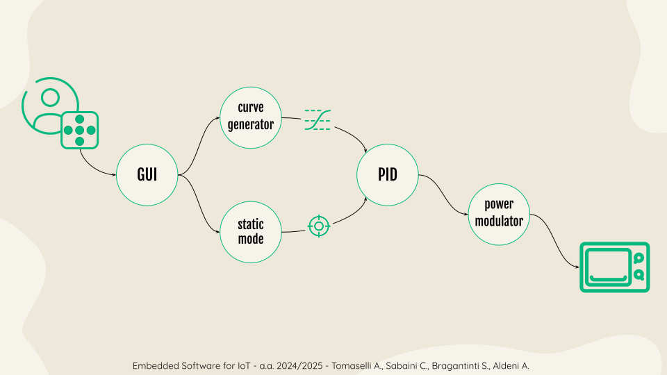
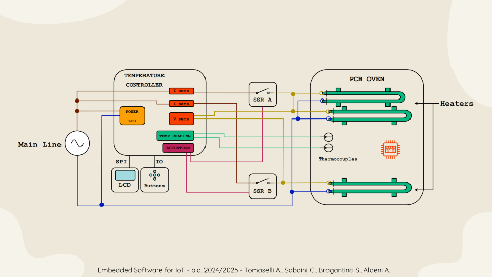

# P.C.B. - PCB Circuit Baker

---

## Table of Contents

- [Project Overview](#project-overview)
- [Project Structure](#project-structure)
- [Core Functionality](#core-functionality)
- [Features](#features)
- [Control Flow](#control-flow)
- [Usage](#usage)
- [Hardware Requirements](#hardware-requirements)
  - [Schematic](#schematic)
- [Software Requirements](#software-requirements)
  - [Build and Run](#build-and-run)
- [Contribution](#contribution)

---

## Project Overview

This project aims to transform a small electric pizza oven, into a functional PCB oven for reflow operations. It leverages on a custom board based on the STM32F030 microcontroller, with integrated power supply, thermocouple conditioners and SSR driving stages.

**See more:**
- [Pitch Video](https://www.youtube.com)
- [Presentation](https://docs.google.com/presentation/d/1FvlHxZEMd3MMXUBN6C8jSyhKtvd0TKJ8RmZ0mUIsl6k/edit?usp=sharing)

---

## Project structure

PCB-Circuit-Baker

```
📁PCB-Circuit-Baker
├──📁Core
│   ├──📁Inc                      #include files
│   │   ├── adc.h
│   │   ├── buttons_definition.h
│   │   ├── cycle.h
│   │   ├── edge_detector.h
│   │   ├── flash_writer.h
│   │   ├── GEVA_config.h
│   │   ├── GEVA_font.h
│   │   ├── GEVA.h
│   │   ├── high_level_time.h
│   │   ├── icons.h
│   │   ├── main.h
│   │   ├── menu.h
│   │   ├── pb_behaviour.h
│   │   ├── pid.h
│   │   ├── power_modulator.h
│   │   ├── stm32_max6675.h
│   │   ├── stm32_ST7920_spi.h
│   │   ├── stm32f0xx_hal_conf.h
│   │   ├── stm32f0xx_it.h
│   │   └── tab_template.h
│   └──📁Src                       #function implementation
│       ├── adc.c
│       ├── buttons_definition.c
│       ├── edge_detector.c
│       ├── flash_writer.c
│       ├── GEVA.c
│       ├── high_level_time.c
│       ├── icons.c
│       ├── main.c
│       ├── menu.c
│       ├── pb_behaviour.c
│       ├── pid.c
│       ├── power_modulator.c
│       ├── stm32_max6675.c
│       ├── stm32_ST920_spi.c
│       ├── stm32f0xx_hal_msp.c
│       ├── stm32f0xx_it.c
│       ├── system_stm32f0xx.c
│       └── tab_template.c
├──📁Drivers                         #HAL drivers
├── .gitignore
├── .stm32env
├── Firmware.ioc
├── Makefile
├── openocd.cfg
├── README.md
├── startup_stm32f030xc.s
├── STM32-for-VSCode.config.yaml
├── STM32F030.svd
├── STM32F030CCTx_FLASH.ld
└── STM32Make.make
```

---

### Core Functionality

- **STM32F030CCT6**:
  - Generates temperature profile, based on user input
  - Reads temperature from type K thermocouples
  - Modulates power given to the heating elements
  - Handles user interaction with the buttons board 

---

### Features

- **Mode of Operation**:
  - **Static Mode**: allows the user to select and maintain a target temperature.
  - **Temperature Control**: Enables the user to create and follow a temperature profile over a given time period. Profiles can be saved for future use.

- **PID Parameters**:
  - Tunable PID parameters to adjust the control system.
  - Parameters are saved for consistency across sessions.

- **LCD Display**:
  - Acts as the GUI for user interaction with the oven.
  - Displays the temperature profile and current temperature.

- **User Board**:
  - Composed of tactile switches for user interaction with the oven.

---

## Control Flow


---

## Usage

1. Connect the oven to the main power supply.
2. (Optional) Adjust the parameters as needed.
3. Select the desired mode of operation.
4. Insert the PCB into the oven.
5. Press the start button.
6. Wait for the reflow process to complete.
7. Remove the PCB carefully.
8. Enjoy your ~~pizza~~ perfectly soldered PCB!

---

## Hardware Requirements

To use this project, you will need the following hardware:

- electric pizza oven
- depending on heating capabilities of the oven, more heating elements
- controller board
- 2 type K thermocouple
- 2 Solid State Relay, with correct power rating
- wires, metal sheet scraps and insulating material
- a bit of ingenuity to integrate all components together

### Schematic



---
  
## Software Requirements

To use this project, you will need the following software:

- OpenOCD
- ARM toolchain

---

## Build and Run

1. Clone the repository:
```shell
$ git clone git@github.com:chiarasabaini/PCB_Circuit_Baker.git
```

2. Navigate to the project directory:
```shell
$ cd PCB_Circuit_Baker
```

3. Build the project:
```shell
$ make flash -j -f STM32Make.make
```
---

## Contribution

- Aris Tomaselli
- Chiara Sabaini
- Silvia Bragantini
- Andrea Aldeni

> This project is a collaborative effort by all team members. We adopted a pair programming approach, frequently meeting to work together. Tasks were shared among us, and we supported each other in solving any challenges that arose.
